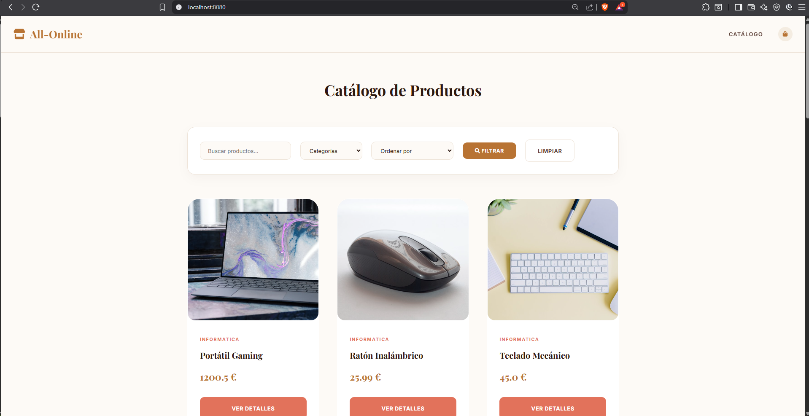
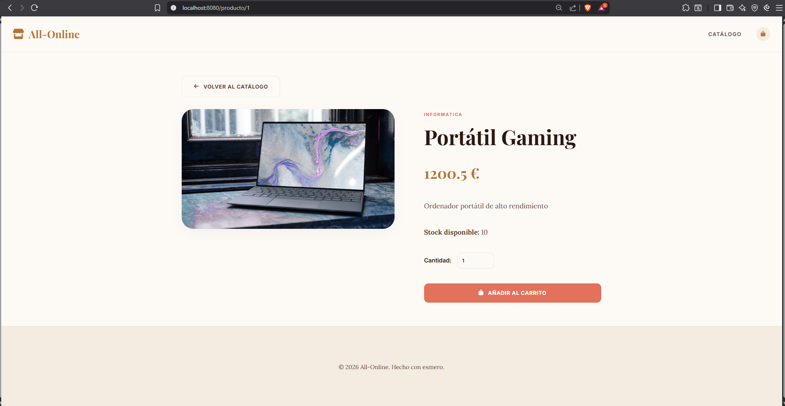
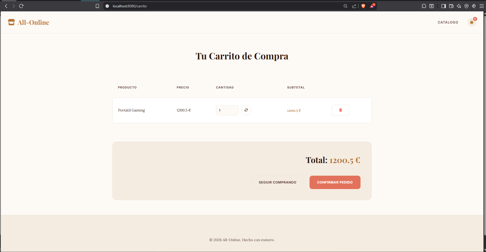

# 🛍️ All-Online 

Bienvenido a **All-Online**, una plataforma de comercio electrónico. Este proyecto está construido con **Java Spring Boot**, **Thymeleaf** y **MySQL**.

## 🚀 Cómo Ejecutar el Proyecto

### Requisitos Previos
*   **Maven** (opcional, si se usa el `mvnw` incluido).
*   **MySQL Server** en ejecución.

### Pasos
1.  **Configurar la Base de Datos**:
    *   Crea una base de datos llamada `tienda_online` en tu servidor MySQL.
    *   Ejecuta el script `src/main/resources/database.sql` para crear las tablas y cargar los datos iniciales.
2.  **Configurar Credenciales**:
    *   Revisa `src/main/resources/application.properties` y ajusta `spring.datasource.username` y `spring.datasource.password` según tu configuración de MySQL.
3.  **Arrancar la Aplicación**:
    *   Desde la terminal: `./mvnw spring-boot:run`
    *   Desde un IDE (Eclipse/IntelliJ): Ejecuta la clase `TiendaOnlineApplication.java`.
4.  **Acceder**: Abre [http://localhost:8080](http://localhost:8080) en tu navegador.

---

## 🏗️ Modelo de Datos

El sistema utiliza un esquema MVC clásico con las siguientes entidades:

*   **Producto**: Representa los artículos del catálogo. Incluye nombre, descripción, precio, stock, categoría y URL de imagen.
*   **Pedido**: Registra las compras realizadas, con fecha, total y estado.
*   **LineaPedido**: El detalle de cada producto en un pedido, vinculando productos con pedidos y guardando el precio unitario en el momento de la compra.

---

## 🖼️ Vistas de la Aplicación

| Vista | Descripción | Captura |
| :--- | :--- | :--- |
| **Catálogo** | Pantalla principal con grid de productos, búsqueda por texto, filtro por categoría y ordenación por precio. |  |
| **Detalle** | Información extendida del producto, stock disponible y opción para añadir al carrito. |  |
| **Carrito** | Gestión de productos seleccionados, actualización de cantidades y confirmación de pedido. |  |

---

## 🔍 Ejemplos de URLs de Catálogo

La aplicación permite filtrar y ordenar mediante parámetros de consulta:

*   **Búsqueda por texto**: `http://localhost:8080/?q=gaming`
*   **Filtro por categoría**: `http://localhost:8080/?categoria=ELECTRONICA`
*   **Ordenación por precio (Asc)**: `http://localhost:8080/?sort=precio_asc`
*   **Combinado**: `http://localhost:8080/?q=silla&categoria=HOGAR&sort=precio_desc`

---

## 🛠️ Configuración de la Base de Datos (Detalle)

Para que el proyecto funcione correctamente, la base de datos se configura en dos niveles:

1.  **Nivel Físico (SQL)**:
    *   El archivo `src/main/resources/database.sql` contiene la definición DDL (`CREATE TABLE`) y DML (`INSERT INTO`).
    *   Es fundamental cargar este archivo primero para disponer de las fotos locales y las categorías iniciales.

2.  **Nivel Aplicación (JPA)**:
    *   En `application.properties` se define el conector JDBC.
    *   `spring.jpa.hibernate.ddl-auto=update`: Permite que Hibernate ajuste las tablas si hay cambios leves en las clases Java.
    *   `ProductoRepository`: Utiliza consultas JPA y `@Query` para obtener categorías dinámicas directamente de los datos reales.
